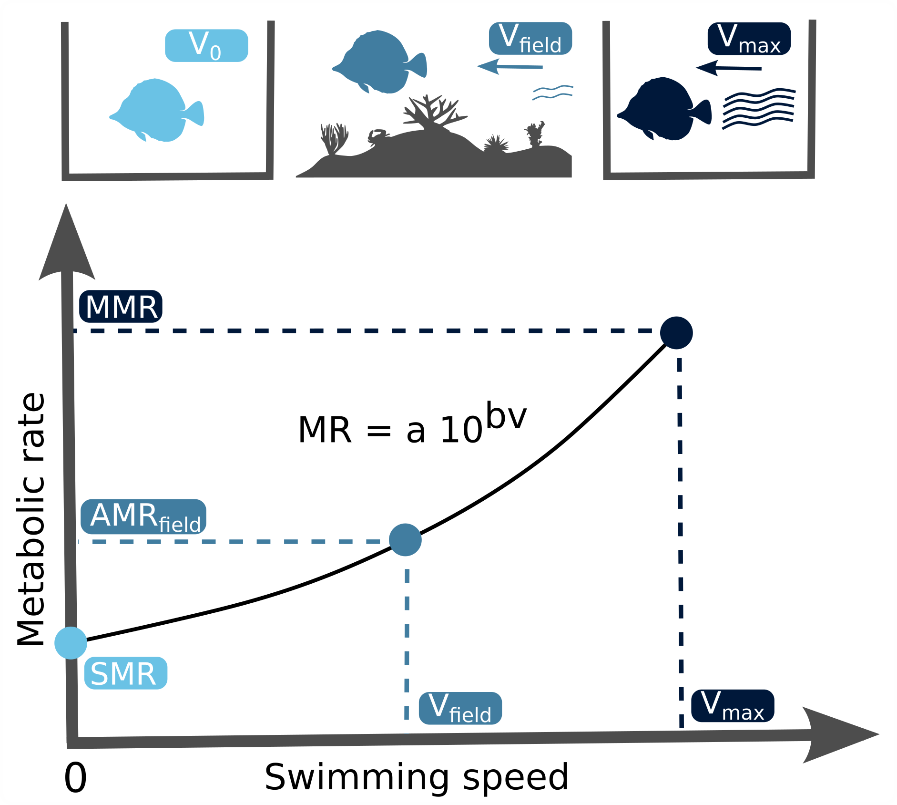

---
output:
  pdf_document:
    latex_engine: xelatex
    citation_package: biblatex
    includes:
        in_header: preamble.tex
  word_document:
    fig_caption: yes
    reference_docx: ../text/word_template.docx
bibliography: ../text/activity.bib
csl: mee.csl
---

```{r setup, include = FALSE}
knitr::opts_chunk$set(echo = TRUE)
library(flextable)
source("../R/packages.R")
```

\pagenumbering{arabic}

# The use of stereo-video monitoring and physiological trials to estimate metabolic demands of reef fishes in the wild
     

\noindent Nina M. D. Schiettekatte^1,2\*^, Francesca Conte^1,2\*^, Beverly French^3^, Simon J. Brandl^1,2,4^, Christopher J. Fulton^5^, Alexandre Mercière^1,2^, Tommy Norin^6^, Sébastien Villéger^7^, Valeriano Parravicini^1,2^


\singlespace \fontsize{10}{12}\selectfont 

\noindent ^1^ PSL Université Paris: EPHE-UPVD-CNRS, USR 3278 CRIOBE, Université de Perpignan,
66860 Perpignan, France

\noindent ^2^ Laboratoire d'Excellence “CORAIL,” Perpignan, France

\noindent ^3^ Center for Marine Biodiversity and Conservation, Scripps Institution of Oceanography, University of California, San Diego, CA, USA

\noindent ^4^ CESAB-FRB, 5 Rue de l'Ecole de Médecine, 3400 Montpellier, France

\noindent ^5^ Research School of Biology, The Australian National University, Canberra, ACT, Australia

\noindent ^6^ DTU Aqua: National Institute of Aquatic Resources, Technical University of Denmark, 2800 Kgs. Lyngby, Denmark

\noindent ^7^ MARBEC, Université de Montpellier, CNRS, IFREMER, IRD, 34 095 Montpellier, France

\doublespace \fontsize{12}{14}\selectfont
\setlength{\parindent}{15pt}

\noindent \* These authors contributed equally

\noindent \textbf{Correspondence to:} N.M.D.S.; Email: nina.schiettekatte@gmail.com

## Abstract

Organismal metabolic rates are the basis of energy and nutrient fluxes through ecosystems. In the marine realm, fishes are the most prominent consumer species. However, their metabolic demand in the wild (field metabolic rate, FMR) is poorly documented, because it is very challenging to measure directly. Here, we introduce a novel approach to estimating the component of FMR associated with voluntary activity in nature (i.e., the field active metabolic rate, $AMR_{field}$). We do this by combining laboratory-based respirometry and field-based stereo-video systems to estimate the activity of individuals. We exemplify our approach by focusing on seven coral reef fish species, for which we quantified standard and maximum metabolic rates (SMR and MMR, respectively) in the laboratory, and body sizes and swimming speeds in the field. Based on the relationships between metabolic rate, body size, and swimming speeds, we show that the activity scope (i.e., the ratio between $AMR_{field}$ and SMR) varies from 1.2 to 3.2 across species and body sizes. Furthermore, we demonstrate that the scaling exponent for $AMR_{field}$ varies across species and can substantially exceed the widely assumed value of 0.75 for standard metabolic rates. Finally, by scaling organismal $AMR_{field}$ estimates to the assemblage level, we show the potential effect of this variability on community metabolic demand. As a non-destructive, widely applicable technique, our approach can improve our ability to estimate elemental fluxes mediated by a critically important group of aquatic animals.


## Keywords
fish, swimming speed, field metabolic rate, activity, activity scope, metabolic scaling, metabolism

## Introduction


Anthropogenic stressors, such as climate change, over-harvesting, and pollution, are affecting biological communities at an unprecedented rate [@Halpern2008; @Venter2016].
Scientists and policy-makers are becoming increasingly concerned that these community impacts will irreversibly alter key ecosystem functions, preventing these natural systems from maintaining indispensable services to humans [@Cardinale2012].
In this context, tools to quantify and monitor ecosystem processes are valuable [@Tilman2014].
However, while there is a long-standing tradition in measuring ecological processes in mesocosms and controlled *in situ* experiments, the assessment of rates of ecological processes in natural conditions is still in its infancy [@Reich2012], especially for marine ecosystems [@Brandl2019front]. \par

In coastal marine ecosystems, fishes represent one of the most thoroughly studied, ecologically important, and economically valuable group of consumers [@Bozec2004; @Tamayo2018].
Despite the complexity of measuring the contribution of mobile species to ecosystem fluxes [@Wilson2010], several attempts have been made to quantify contributions of fishes to nutrient and carbon cycling [@Villeger2017; @Brandl2019front].
These functions are usually quantified at the individual level, that can then be scaled up to community levels through an additive framework [@Barneche2014;  @Allgeier2014; @Brandl2019science; @Morais2019]. While there are inherent limitations to this approach, individual-based modeling currently represents our best means to quantify ecological processes across communities of mobile, aquatic organisms. Nevertheless, the accuracy of these approaches inevitably depends on our capacity to precisely estimate physiological requirements and expenditures of individuals in their natural environment. \par

The metabolic rate of living organisms is an essential determinant of their physiological requirements and therefore represents a crucial parameter to estimate the flow of energy and nutrients in any ecosystem [@Brown2004; @Allen2005].
Theory predicts that individual metabolic rate increases sub‐linearly with body mass according to a power function with a scaling exponent of approximately 0.75 [@West1997; @Gillooly2001; @Brown2004].
This value has been widely accepted and appears to hold roughly true for standard metabolic rates of marine fishes [@Barneche2014]. Therefore, this metabolic scaling exponent has been used to estimate community-level metabolic rates as well [e.g., @Deutsch2015; @Holt2015; @Cheung2013].
However, the verification of this scaling exponent is based on laboratory experiments, and whether the metabolic scaling of fishes in the wild follows this general rule remains to be explored. \par

Metabolic rates of fishes are generally evaluated through two metrics: i) standard metabolic rate (SMR) [@Fry1957; @Vinberg1960], which corresponds to the metabolic rate of an inactive and fasting individual [@Clark2013]; and ii) maximum metabolic rate (MMR), which corresponds to the aerobic metabolic rate of an animal that is exercising at full capacity [@Norin2016].
Knowledge of these two metrics allows for the calculation of a fish's aerobic scope, which is the difference between MMR and SMR and represents the capacity to elevate metabolic rate above maintenance to support energetically demanding tasks such as physical activity and digestion [@Clark2013].
Within species, aerobic scope tends to increase with body mass regardless of being expressed in absolute (MMR minus SMR) or factorial (MMR divided by SMR) values [@Halsey2018], as the scaling exponent of MMR is often observed to be higher than that of SMR [@Killen2007; @Glazier2005].
Both SMR and MMR can be estimated relatively accurately in the laboratory through measurements of oxygen uptake rates [@Clark2013; @Norin2016; @Svendsen2016; @Chabot2016].
However, animals in the wild rarely reside at SMR or exercise maximally.
Thus, calculations of energy expenditures in wild fishes are hamstrung by our inability to accurately estimate metabolic rates in fishes that pursue their normal, daily activities in their natural environment.

The field metabolic rate ($FMR$) represents the average metabolic rate of an individual in the wild [@Chung2019; @Nagy2005] and lies somewhere between SMR and MMR [@Nagy2005].
On average, free-living fishes in their natural habitats will only exploit a given proportion of their aerobic scope and, in non-sedentary fishes, physical activity will be a major component of FMR [@Chung2019].
Thus, the factorial scope for activity (FSA), which corresponds to the ratio between the component of FMR related to physical activity (the field active metabolic rate, $AMR_{field}$) and the SMR, is a better reflection of energy expenditure in the wild [@Chung2019], bearing in mind that internal homeostatic processes such as digestion and reproduction also incur an energetic cost as part of the full FMR.
In terrestrial vertebrates, where the doubly-labeled water technique has allowed for widespread quantification of FMR [@Webster1989], the metabolic scaling exponent of FMR tends to be higher than that of SMR (~0.8; @Nagy2005).
While the metabolic scaling exponent of MMR in fishes ranges approximate or exceed 0.8 as well, the scaling of FMR or $AMR_{field}$ remains poorly documented [@Norin2016]. Understanding how metabolic rate scales with body mass in the wild is fundamentally important for fisheries (e.g., stock assessments) and predictions of the effects of climate change, as the metabolic scaling exponent is an integral part of growth models used to forecast the size of fishes at both current and future temperatures [@Vonbertalanffy1957; @Cheung2013; @Deutsch2015; @Marshall2019].

Since FMR is challenging to measure for water-breathing animals in the aquatic environment [@Treberg2016], it has only been estimated for a small number of fishes [e.g., @Lucas2011; @Murchie2011; @Cruz-Font2016; @Chung2019].
These estimates are largely derived from biotelemetry approaches that rely on accelerometry tags and heart rate measurements calibrated with rates of oxygen uptake in the laboratory [@Treberg2016; @Grans2009].
A major limitation of biotelemetry is that their application is limited to large individuals as it requires surgical attachment or implantation of tags [@Grans2009].
More recently, FMR has been estimated from the isotopic composition of carbon in fish otoliths [@Chung2019].
However, this approach relies on destructive sampling and the generality of the undoubtedly promising results are yet to be applied across a broad range of species.
Thus, non-invasive methods to estimate FMR on many co-occurring fish species in the field are needed to better understand the contributions of fishes to ecosystem functioning.

Here, we propose a new approach to estimate a major component of the FMR, the $AMR_{field}$.
Specifically, we estimated SMR and MMR of seven reef fish species using traditional respirometry techniques in the laboratory, and then quantified *in situ* swimming speeds of the same species using underwater stereo-video systems.
This permitted us to derive $AMR_{field}$ and the factorial scope for activity (FSA) on the basis of the theoretical relationship between metabolic rate and swimming speed, and to assess the mass-scaling exponents of $AMR_{field}$ for each species.
By combining our results with underwater visual census data of fish size and abundance on reefs around Mo'orea, French Polynesia, we also quantified assemblage-level SMR and $AMR_{field}$.
In doing so, we demonstrate the viability and applicability of our approach to tackle questions across fields of organismal, community, and ecosystem ecology in the marine biome.

\newpage

## Methods

### Summary
Our approach is based on the relationship between swimming speed and metabolic rate [@Binning2013; @Norin2016; @Torres1983].
Specifically, we rely on the notion that the standard metabolic rate (SMR) represents the metabolic rate of an individual when its swimming speed is zero ($v_0$), while the maximum metabolic rate (MMR) represents the oxygen uptake rate of individuals at their maximum – or critical – swimming speed ($v_{max}$)(figure 1).
Further, we assume that metabolic rates vary predictably with swimming speed following a traditional power function [@Brett1964; @Korsmeyer2002].
Therefore, on the basis of knowledge of SMR and MMR along with the $v_0$ and $v_{max}$ of individuals, the active field active metabolic rate ($AMR_{field}$) of a species can be estimated if the average swimming speed ($v$) of individuals for a specific body size is known.
We estimated SMR and MMR using respirometry in the laboratory, obtained $v_{max}$ through empirical data available in the literature, and estimated $v$ using stereo-camera video recordings in the field.
We then used these estimates of $AMR_{field}$ to quantify the factorial scope for activity (FSA), and the metabolic scaling exponent for $AMR_{field}$.
Finally, to evaluate the impact of assessing assemblage-level metabolic rates on the basis of a realistic proxy of field metabolic rate, $AMR_{field}$ (instead of using the more commonly measured SMR as an estimate of minimum energetic requirements), we scaled up our estimates at assemblage level according to visual census data of fish sizes and abundances on a coral reef in Mo’orea, French Polynesia.



Figure 1. Definition of terms used to describe aspects of fish metabolism and their inter-relationships. SMR is standard metabolic rate calculated as the oxygen uptake rate ($\dot{M}O_{2}$ at swimming speed 0 ($v_0$). $AMR_{field}$ is field active metabolic rate measured as $\dot{M}O_{2}$ at spontaneous swimming speed ($v$). FMR is field metabolic rate including $AMR_{field}$ and the energy needed for digestion and reproduction. MMR is maximum metabolic rate, which can be measured as the $\dot{M}O_{2}$ at maximum (critical) swimming speed ($U_{crit}$).


### Model species

We focused on seven common reef fish species with varying body sizes and shapes, trophic strategies, and behavioral patterns: *Cephalopholis argus* (family Serranidae), a large, fusiform, sedentary piscivore; *Chaetodon ornatissimus* (family Chaetodontidae), a small-bodied, laterally compressed, obligate coral feeder; *Chromis iomelas* (family Pomacentridae), a small, schooling planktivore; *Ctenochaetus striatus* (family Acanthuridae), a medium-sized, grazing detritivore; *Naso lituratus* (family Acanthuridae), a large-bodied, grazing herbivore feeding on macroalgae; *Odonus niger* (family Ballistidae), a large-bodied schooling planktivore; and *Zebrasoma scopas* (family Acanthuridae), a compressed, small-bodied, grazing herbivore feeding on filamentous algae.
All data were collected in Mo’orea, French Polynesia, between March 2018 and February 2019.
For respirometry experiments, individuals were collected in the lagoon (depth range 1-6m) next to Opunohu Bay (17.4928°S, 149.8555°W) with hand nets and clove oil.

### Standard and maximum metabolic rate

To quantify SMR and MMR, we conducted intermittent-closed respirometry experiments [@Steffensen1989; @Clark2013] at 28+-0.5 °C on a total of 68 individuals across the seven study species with the sample size per species ranging between four and 23 individuals.
After an acclimation and fasting period of 48 h in aquaria, the fish were individually transferred to a water-filled tub at 28°C and sequentially chased by the experimenter until visibly exhausted to elicit MMR [@Norin2011; @Clark2012].
Once the chasing was concluded, each individual was immediately placed in a respirometry chamber submersed in an ambient and temperature-controlled tank, where they were left for approximately 24 h to reach SMR.
The intermittent respirometry cycles consisted of a measurement (closed) period followed by an open period during which the respirometry chambers were flushed with fully aerated water from the ambient tank.
Based on previous work [@Norin2016], we considered the oxygen uptake rate ($\dot{M}O_{2}$ ) during the first closed cycle (directly after transferring the fish) to be reflective of the individual’s MMR.
Depending on fish size, respirometry chambers ranged in volume (including tubes and pumps) from 0.38 to 4.4 L, and measurement and flush periods lasted between 2 to 9 min and 3 to 5 min, respectively.
SMR was calculated as the average of the 10 % lowest $\dot{M}O_{2}$ values measured during the entire respirometry trial, after the removal of outliers, while MMR was calculated from the slope of the first measurement period [@Chabot2016].

### Swimming speed

We used two underwater stereo-video systems that were placed on the seafloor to record fish movements. Each video system consisted of two small action cameras (GoPro Hero5 Black), mounted 90 cm from each other at an angle of approximately 6°. This method allows three-dimensional (3D) measurements [@Butail2012; @Hughes1996].
To analyze the recorded videos, we used VidSync, an open-source Mac application providing accurate 3D measurements [@Neuswanger2016], which allow for the synchronization, calibration, and analysis of videos.
We recorded calibration videos to correct for the nonlinear optical distortion of the images due to camera lenses and underwater housings, and to define the 3D coordinate system (x, y, z) used throughout the analyses.
Errors in length measurements through video analysis increase with distance from the cameras [@Neuswanger2016].
Thus, for each underwater stereo-video system, we fitted a linear regression model describing the error in measurements as a function of their distance from the nearest camera, which we used to adjust all measurements of distances and fish lengths (figure 1).
We recorded twenty stationary stereo-videos between November 19^th^ 2018 and December 12^th^ 2018. Videos were recorded at 12 to 14 m depth on the reef slope at the Tiahura long-term monitoring site in Mo’orea (17° 29' 00.6" S, 149° 54' 20.9" W) and at five different time-periods: 5:00–7:00, 8:00–10:00, 11:00–13:00, 14:00–16:00, and 17:00–18:00. Each recording lasted for ~1-1.5 h.
We then took measurements during three 10 min sequences with intervals of 10 min that excluded the first 2 min to account for the presence of divers.
We took measurements for all fishes visible in both cameras for 3 to 5 s during the three 10 min sequences.
For each individual, fork length was measured three times from the videos as the straight-line distance between the fish’s head and its tail fork, and three to five consecutive swimming speeds were measured as the distance the fish moved over 3 to 5 s.
Final fish lengths and swimming speeds were then calculated as the mean of the repeated measurements. In total, we recorded lengths and speeds for 634 individuals, with sample sizes per species ranging between 64 and 264 individuals.

### Maximum swimming speed

We extracted maximum swimming speeds ($U_{crit}$) from previous work [@Fulton2007]. $U_{crit}$ is defined as the swimming speed at which a fish becomes exhausted and stops swimming when it is exposed to regular incremental changes in speed in an experimental flume [@Brett1964]. In these experimental conditions, $\dot{M}O_{2}$ measured at $U_{crit}$ corresponds to MMR [@Norin2016]. In the original work of @Fulton2007, $U_{crit}$ of 192 individuals of five families and their corresponding lengths were measured, and these measurements were then used in the present study to relate maximum swimming speed with body size and aspect ratio of the tail, as a proxy for variations in swimming ability. The aspect ratio of the tail of all species were retrieved from Fishbase [@Froese2014].

### Data analysis

We quantified $AMR_{field}$ and factorial scope for activity (FSA) by combining multiple regression models, that describe the relationships between SMR and MMR with body mass, swimming speed ($v$), and maximum swimming speed [$v_{max}$; from @Fulton2007] with body size.
First, we used the respirometry data to fit a relationship between either SMR or MMR and body mass using a Bayesian hierarchical model, while accounting for the co-variation between MMR and SMR.
We define the $log_{10}$ of SMR and MMR to be normally distributed with a mean ($\mu$) and a standard deviation ($\sigma$) as follows:

$${{\textrm{log}}_{10}{(\textrm{MR}_{i})}} \sim {\textrm{Normal}(\mu_{i}, \sigma)},$$
$$\mu_{i} = (a + a_{j,k}) + (b + b_{j,k}){\textrm{log}_{10}(\textrm{weight}_i)}, $$

where $i$ is the individual, $j$ is the species, $k$ is the type of metabolic rate (SMR or MMR), $a$ is the global intercept of the regression; $a_{j,k}$ is the effect on the intercept for each species and type of metabolic rate, $b$ is the global slope of $log_{10}(weight)$, $b_{j,k}$ is the effect on the slope for each species and type of metabolic rate.
We obtained the mean intercept and slope per species by summing global- and species-level parameters. We used an informative normal prior for the global slope exponent (i.e., metabolic scaling exponent) with average 0.75 and 0.1 as the standard deviation [@West1997]. For all other parameters, we used weakly informative priors [@Burkner2017].

Second, using the data retrieved from the video analyses, we fitted a hierarchical Bayesian regression model for estimating fish swimming speed as a function of body length. We defined the $log_{10}$ transformation of swimming speed to be student-t distributed with degrees of freedom ($\nu$), mean ($\mu$), and a standard deviation ($\sigma$).The student’s t-distribution was applied to build a robust regression, as our data includes outliers [@Motulsky2006].

$$\textrm{log}_{10}(\textrm{speed}_{i}) \sim \textrm{Student}(\nu, \mu_{i}, \sigma),$$
$$\mu_{i} = (a + a_{j}) + (b + b_{j})\textrm{log}_{10}(\textrm{length}_i),$$

where $i$ is the individual, $j$ is the species, $a$ is the global intercept of the regression, $a_j$ is the effect on the intercept for each species, $b$ is the global slope , $b_j$ is the effect on the slope of for each species. For each species, regression exponents were estimated by summing two effects of the model: the global parameter and the species-specific effect on the global parameter.

Thirdly, we fitted a similar model to predict maximum swimming speed in function of body length and aspect ratio using data extracted from @Fulton2007, including random effects of the interaction between family and body shape on the intercept and slope of body size.:

$$log_{10}(maxspeed_{i}) \sim Student(\nu, \mu_{i}, \sigma),$$
$$\mu_{i} = (a + a_{j}) + (b + b_{j})log_{10}(length_i) + AR,$$

where $i$ ,$j$ is the interaction of family and body shape, $a$ is the global intercept of the regression, $a_j$ is the effect on the intercept for each family and body shape, $b$ is the global slope , $b_j$ is the effect on the slope for each family and body shape, and $AR$ is the aspect ratio of the tail.
Here, we also applied the Student’s t-distribution and used general uninformative priors. We then used this model to estimate the maximum swimming speed of the species included in our study. Aspect ratio's were extracted from Fishbase [@Froese2014].

### Factorial aerobic scope, field active metabolic rate, and factorial scope for activity calculations

We predicted the factorial aerobic scope (FAS), field active metabolic rate ($AMR_{field}$), and factorial scope for activity (FSA) for the full size range of all model species (per cm).
To estimate the fish’s FAS at each possible length, we first predicted their SMR and MMR by calculating their weight using published length-weight relationship accessed through FishBase [@Froese2014], and making predictions based on our model parameters.
For each iteration of the prediction, FAS was calculated as $FAS = \frac{MMR}{SMR}$ [@Fry1947; @Killen2016].
Finally, we summarized the FAS for each species at all sizes by taking means, standard deviations, and 95% credible intervals.

FSA is obtained by dividing the fish’s $AMR_{field}$ ($\dot{M}O_{2}$ at average speed $U$) by their SMR. To describe the relationship between $\dot{M}O_{2}$ and swimming speed ($U$), Brett (1964) [@Brett1964] used a traditional power function: $\dot{M}O_{2} = a10^{bU}$ . Here, we applied the $log_{10}$-transformed form [@Korsmeyer2002]. Consequently, the following equation was used in this study to determine individual $AMR_{field}$:
$$log(AMR_{field}) = log(SMR) + \frac{log(MMR) - log(SMR)}{U_{crit}} U,$$

where we consider the slope $b = \frac{log(MMR) - log(SMR)}{U_{crit}}$. Here, $U$ is predicted through our model relating length and swimming speed, $U_{crit}$ is predicted for each length and species using our model for family-level maximum swimming speeds, and SMR and MMR is predicted as stated above. To include an estimate of uncertainty, we included 1000 iterations of estimates of the swimming speed $U$. For $U_{crit}$, SMR and MMR we used the median of the predicted values in this step.

Once we determined $AMR_{field}$, we calculated FSA with the following equation:
$$FSA = {\frac{12 AMR_{field} + 12 SMR}{24 SMR}}.$$
We repeated this for each iteration and then summarized FSA per species per size. We assumed that fish rested for 12 h (i.e., sleeping) [@Marshall1972].
As such, for all studied species we assumed that they are active during the day and inactive during the night.

### Assemblage-level estimates
In 2016, reef fish communities were monitored across 13 sites on the outer reef around Mo’orea using underwater visual censuses.
During each census, a single diver swam along a transect of 25 m and counted all fishes within a width of 2 m.
All fishes were identified to the species level and their length was estimated to the nearest 1 cm.
Each transect covered an area of 50 m², except Tiahura and Haapiti, which covered an area of 100 m² each.
At each site, three transects were performed, except for Tiahura and Haapiti where four and two transects were performed respectively.
We extracted data for our model species from this database, which resulted in 802 individuals across the seven species.
Then, we quantified the SMR and $AMR_{field}$ for each individual using the above-mentioned methodology.
Finally, we calculated the total SMR and $AMR_{field}$ of the fish assemblage composed of the seven species at each site by summing across individual estimates.


## Results

### Standard and maximum metabolic rates 
\noindent The regression model predicting metabolic rates (log~10~ of SMR and MMR) as a function of log~10~ of body mass with varying slopes and intercepts per species had a Bayesian R^2^ of 0.96 (Table 1; Figure 2). The average metabolic scaling exponent across species was 0.73 for SMR and 0.78 for MMR (Table 1). The median species-specific scaling exponents varied between 0.71 and 0.76 for SMR, and between 0.77 and 0.78 for MMR. 

```{r c7t1, echo = FALSE}
table <- drake::readd(table_mr)
flextable(table) %>%
   italic(j = "species") %>%
   fontsize(size = 6) %>%
   fontsize(size = 8, part = "header") %>%
   set_caption("Overview of species-specific slope coefficients (scaling exponents) of the regression of $log_{10}$-transformed SMR and MMR on function of $log_{10}$-transformed body mass. The intercept for each species is expressed as the back-transformed value for an individual of 1g. Values in between brackets represent the 95\\% CI.") %>%
   fit_to_width(8.5)
```
\newpage         
          
```{r, echo = FALSE, fig.width = 10, fig.height = 6, fig.fullwidth = TRUE, fig.cap = "Figure 2. Linear regressions between log~10~-transformed metabolic rate (g O~2~ d^−1^) and weight (g) for the study species, predicted by model 1. Symbols represent empirical measurements. Solid and dashed lines represent predicted mean standard metabolic rate (SMR) and maximum metabolic rate (MMR) values, respectively. Transparent areas are the 95% credible intervals of the fitted values of the regression."}

readd(plot_mr)

```

\newpage
### Swimming speed 
\noindent  The regression model predicting species-specific swimming speed as a function of body size had a median Bayesian R^2^ of 0.57 and its residual variance ($\sigma$) was 0.37. 
The average species-specific slope values varied between 0.18 and 0.97 (Figure 3, Table S2). 
At the individual scale, the 95% credible interval of swimming speed predictions varied between 28.5 and 32.4 cm s^−1^ across all species and size classes. For maximum swimming speed, our model showed an increase with body size and aspect ratio (Table S3), with a median Bayesian R^2^ of 0.46. We then used this model to estimate maximum swimming speeds (Figure 3).
            

```{r, echo = FALSE, fig.width = 10, fig.height = 6, fig.fullwidth = TRUE, fig.cap = "Figure 3. Linear regressions between log~10~-transformed speed (cm s^−1^) and length (cm) for the seven studied fish species. Symbols represent the raw data of individuals measured through stereo-video analysis. Solid lines and shaded areas represent the predicted mean values, and associated 95% credible interval of swimming speeds. The dashed lines represent the predicted maximum swimming speeds."}

readd(plot_speed)

```

### Field metabolic rate, factorial aerobic scope and factorial scope for activity estimations
\noindent  We estimated $AMR_{field}$, FAS, and FSA across the size range of our study species as observed in the monitoring dataset from Mo'orea in 2016. 
Across all species and size classes, average $AMR_{field}$ estimates ranged between 0.001 and 1.013 g O~2~ d^−1^ at the individual level (Table S4). FAS and FSA estimates range between 2.4 and 7.0, and between 1.2 and 3.2, respectively, across species and sizes. The scaling exponent of $AMR_{field}$ was higher than the SMR exponent for all species, except for *C. striatus* (Figure 4a), hence, FSA increased with size for all those species (Figure 4b). The scaling exponent of $AMR_{field}$ was considerably higher than the MMR exponents for *N. lituratus* and *O. niger*. 
\newpage

```{r, echo = FALSE, fig.width = 8, fig.height = 8, fig.fullwidth = TRUE, fig.cap = "Figure 4. a) Fitted scaling exponents for standard metabolic rate (SMR), maximum metabolic rate (MMR), and field metabolic rate (AMR~field~) based on slopes of the log~10~-log~10~ relationships between the metabolic rates (g O~2~ d^−1^) and body mass (g). Lines represent the 95% credible interval and dots indicate the average values. b) Predicted average factorial scope for activity (FSA) for the seven reef fish species across their body size range."}

readd(plot_combined)

```

\newpage

### Assemblage-level predictions

\noindent Scaling up SMR and $AMR_{field}$ to the assemblage level revealed major variation in the two estimates of metabolism, with average SMR (± SD) for this assemblage of seven fish species across sites (ranging between 0.026 ± 0.009 and 0.325 ± 0.021 g O~2~ m^−2^ d^−1^; Figure 5) tending to be about half total $AMR_{field}$ (ranging betwen 0.036 ± 0.014 g O~2~ m^−2^ d^−1^ and 0.465 ± 0.07 g O~2~ m^−2^ d^−1^). Spatial variation in total SMR and $AMR_{field}$ reflected patterns in the relative abundance of the seven study species across sites (Figure 5, Figure S4). Afareaitu, Maatea, Motu Ahi, Taotaha, and Tetaiuo, sites where *C. argus* and *O. niger* dominated the reef fish assemblage, had a total $AMR_{field}$ about twice as high as the total SMR. On the contrary, sites dominated by *C. striatus* (50 to 95% of the total reef fish abundance) had total $AMR_{field}$ 1.27 to 1.41 times higher than total SMR (i.e. Nuarei, Pihaena, Temae, and Tiahura).
\newpage

```{r, echo = FALSE, fig.width = 12, fig.height = 10, fig.fullwidth = TRUE, fig.cap = "Figure 5. Field (AMR~field~) and standard metabolic rates (SMR) of an assemblage of six reef fish species at 13 sites around Mo'orea, French Polynesia. Dashed lines represent 1.5 times the SMR as a reference. Coloured bars display the relative abundances of the reef fish species at each site."}

readd(figure5)

```

\newpage

## Discussion

Field metabolic rate (FMR) is an essential organismal property that mediates elemental fluxes across the food web, thus influencing system-wide movements of energy and nutrients.
By coupling laboratory data on metabolic rates with field observations of body size and swimming activity through stereo-video analysis, we estimated the activity component of FMR (the field active metabolic rate, $AMR_{field}$). Further, we demonstrate that the factorial scope for activity (FSA) of reef fish species varies substantially across species, and that the metabolic scaling exponent of $AMR_{field}$ can substantially exceed the canonical value of 0.75, which also affects community-level estimates of metabolic rate.
Therefore, our results highlight the potential pitfalls of estimating the community-level metabolic rate of heterogeneous reef fish assemblages based on scaled-up estimates of SMR instead of $AMR_{field}$.
We suggest that the coupling of physiological traits with stereo-video analyses provides an opportunity to estimate field metabolic rates of fishes in marine environments that allow for visual assessments. \par

The FSA can be an important parameter to predict the energy consumption of fishes in the wild (e.g., @Schiettekatte2020).
Our estimates of FSA were comparable to previous estimates for a small fresh-water fish, in which the FSA was obtained through a combination of bioenergetic modeling and behavioral observations [~1.9; @Trudel1996].
In contrast, several other fish species may have a much higher $AMR_{field}$ as locomotion has been reported to increase metabolic rate up to five-fold, and up to nine-fold in tuna (*Thunnus albacares*)[@Brill1991; @Chabot2016]. However, it is still challenging to quantify where $AMR_{field}$ lies for most species.

The varying estimates of FSA may relate to the swimming speed and the aerobic capacity of the studied species [@Clark2013].
In our case study, the two fishes with the highest FSA were *O. niger* and *C. argus*, which appear to exploit about 45% and 60% of their aerobic scope in their natural environment, respectively. Therefore, *C. argus* has a high FSA mostly due to its high aerobic scope, while *O. niger* has the highest FSA in our case study both because of a high aerobic capacity and because it uses a larger proportion of it for swimming. On the other hand, fishes with a lower FSA (i.e., *C. iomelas*, *C. ornatissimus*, *C. striatus*, and *Z. scopas*) were quite active, relative to their maximum swimming capacities, and exploited more than 50% of their aerobic scope.
However, because their aerobic scope is low, so is their FSA.

These results corroborate the notion that $AMR_{field}$ in fishes is strongly influenced by ecological traits, such as size, trophic level and habitat use [@Brown2004; @Killen2016; @Nash2015].
Larger fishes tend to have a higher aerobic capacity than smaller species [@Brown2004], and larger sizes in fishes permit the establishment of larger home ranges [@Nash2015].
Furthermore, predators often have a higher metabolic capacity, compared to herbivores, and pelagic fishes often have higher metabolic potential than benthic fishes, as they have high locomotory demands because of their mobility in a 3D environment [@Killen2016; @Nash2015].
Pairwise comparisons among our study species (e.g., the herbivorous *Z. scopas* vs. the carnivorous *C. argus* or the benthopelagic *C. striatus* vs. the epipelagic *O. niger*) strongly support an ecological basis for metabolic differentiation.

Beyond interspecific differences, our results suggest that $AMR_{field}$ scales differently with body mass compared to standard metabolic rates (SMR) or maximum metabolic rates (MMR).
The SMRs of our study species varied predictably with body mass, in accordance with the metabolic theory of ecology [@Brown2004], with the average slope value approximating the allometric scaling exponent of 0.75 predicted by West et al. [@West1997].
In contrast, except for *C. striatus*, all species had a scaling exponent for $AMR_{field}$, that considerably exceeded 0.75.
Consequently, the FSA was positively correlated with body size for most species, suggesting that large individuals of a species consume more oxygen in their natural environment than previously assumed.
For some species, such as *C. argus*, the scaling exponent of $AMR_{field}$ is similar to that of SMR, while for other species such as *N. lituratus* and *O. niger*, the scaling exponent of $AMR_{field}$ is much higher.
Importantly, there is a higher interspecific variability of the scaling exponent of $AMR_{field}$ compared to SMR and MMR.
This underlines the importance of both species identity and body size when estimating FMR.


Scaling up, community-level standard metabolic rates should vary predictively with both community composition and intraspecific size structure [@Barneche2014; @Allen2005)].
However, failing to account for the increased variation in scaling exponents of field metabolic rates may lead to severe underestimates of the contribution of large mobile fishes to the total respiration of fish communities.
Indeed, comparing our assemblage-level estimates based on SMR with assemblage-level estimates based on $AMR_{field}$ reveals the potential pitfalls of using SMR to study community-level metabolic rates (e.g., @Cheung2013; @Deutsch2015; @Holt2015).
The ratio between community-level $AMR_{field}$ and SMR is extremely variable, thus suggesting that universal corrections to convert laboratory-estimated SMR into $AMR_{field}$ are likely unreliable.
For example, communities with a similar biomass and size structure may be considered as having a similar metabolic rate when using SMR as a proxy.
However, if a community includes species that have a much higher metabolic scaling exponent, the role of large individuals, and thus the community-level metabolic rate may be underestimated severely.
Thus, it is important to consider a higher variation in metabolic scaling of FMR than previously assumed if we want to estimate energy flow in fish communities.

While our approach offers a novel way to estimate the activity rate and metabolism of fishes, it comes with some limitations.
First, we used family-level maximum swimming speeds to reconstruct the relationship between metabolic rate and swimming speed [@Fulton2007].
Although we accounted for variation in body shapes, this may introduce some bias into the calculations, as species within a family and body shape can differ substantially.
Further, our method relies on the assumption that metabolic rate varies predictively with swimming speed following a traditional power function [@Brett1964; @Korsmeyer2002]. Ideally, this relationship should be verified empirically by measuring swimming speed and respiration rate simultaneously in the laboratory.
Furthermore, we quantified FSA assuming that fishes’ spontaneous swimming activity follows strict circadian cycles, with all activity occurring diurnally.
However, activity patterns of reef fishes are often flexible [@Zhdanova2006].
While, in principle, all our studied families are diurnally active, some species, (e.g., Serranidae) can be nocturnally active [@Mourier2016].
Thus, our assumption can cause potential underestimates of FSA in *C. argus* and other species with more flexible circadian activity patterns.
Currently, stereo-video recordings are unable to quantify fish swimming speeds at night, as measurements are inaccurate and imprecise in darkness and poor visibility [@Neuswanger2016].
However, infrared lighting in stereo-video recordings could provide a solution to observe nocturnal behavior and movement in fishes [@Bassett2011]. \par

Finally, while $AMR_{field}$ than SMR or routine metabolic rate (the average laboratory-estimated metabolic rate of fish kept in respirometry chambers, which includes spontaneous activity; @Norin2020, it still doesn not include all energy expenditure of fishes in the wild, such as reproduction and digestion.
Digestion (often expressed as specific dynamic action; SDA) can be a large component of the energy budget of fishes (e.g., ~17% of SMR; @Holt2015).
SDA can be measured in the laboratory, where a fish is given a meal and the oxygen consumption is measured for the duration of the digestion of this meal.
SDA relates predictively to both meal size and body mass of a fish [@Secor2009], but using this relationship to calculate SDA of species in natural communities is not feasible.
It is nearly impossible to track frequency of meals and meal sizes of fishes in the wild, even though some bioenergetic modeling allows for an approximation of consumption rates (e.g., @Schiettekatte2020).
Further, these experiments are largely based on predatory fishes, and do not necessarily represent natural feeding behavior as many fishes do not consume and digest a meal before eating the next meal.
Notably, herbivores and detritivores, but also planktivores, feed constantly, and their energy expenditure related to digestion is understudied.
Therefore, we stress the need for more research on the energy consumption of digestion across a wide range of fishes to achieve improved FMR approximations for fish communities in the wild.

Despite these limitations, our proposed method increases our awareness of the variation in $AMR_{field}$ among reef fishes, which is necessary to understand ecosystem-level estimates of elemental fluxes.
So far, the quantification of $AMR_{field}$ is limited to laboratory techniques that are reliant on destructive sampling [analysis of trace elements in otoliths; @Chung2019], or restricted to species that are big enough to be tagged with biotelemetry equipment [@Treberg2016; @Brodie2016].
When combined with respirometry trials, stereo-video offers a nondestructive alternative to these techniques that can be applied to all species that can be reliably observed using *in situ* cameras.
While the post-hoc treatment of the stereo-video outputs demands significant time and effort, the development of open source software to automate data collection from video will greatly strengthen our ability and non-destructive approach to quantifying reef fish $AMR_{field}$ [@Bassett2011; @Guenard2008].

## Acknowledgements
We thank the staff at CRIOBE, Moorea for field support. Further we would like to express gratitude to Camille Gache and Yann Lacube for their help in the field. Finally, we thank CRIOBE for sharing UVC data from their long-term monitoring program.
   
## Funding
This work was supported by the BNP Paribas Foundation as a part of the ReefServices project and the Agence National de la Recherche (REEFLUX, ANR-17-CE32-0006). TN was supported by funding from the Danish Council for Independent Research (DFF-4181-00297) and the European Union’s Horizon 2020 research and innovation program under the Marie Skłodowska-Curie grant agreement No. 713683.

## Author contributions
NMDS conceived the idea and FC, NMDS, and VP designed methodology; BF and NMDS recorded *in situ* stereo-videos; FC performed video analysis; AM and NMDS collected fishes and AM performed respirometry experiments; CJF collected data on maximum swimming speed; FC and NMDS analysed the data and led the writing of the manuscript. All authors contributed significantly to the drafts and approved the final version for publication.


## Supporting information

```{r, echo = FALSE, fig.width = 10, fig.height = 6, fig.fullwidth = TRUE, fig.cap = "Figure S1. Linear regressions between the error (cm) in measurements collected by video analysis and the distance (cm) from the nearest camera for both underwater stereo-video systems. Each color represents an underwater stereo-camera system used in this study. Shaded areas show the linear regression standard errors."}


```


```{r, echo = FALSE, warning=FALSE, message=FALSE}
table <- drake::readd(table_speed)
flextable(table) %>%
  italic(j = "species") %>%
  fontsize(size = 8) %>%
  fontsize(size = 10, part = "header") %>%
  set_caption("Table S2: Overview of species-specific slope and intercept coefficients for the regression of natural log-transformed swimming speed on natural log-transformed body length (in cm). The 95% credible interval is displayed in the parentheses.") %>%
  autofit() 
```
\newpage      


```{r, echo = FALSE, warning=FALSE, message=FALSE}
table <- readd(table_speedmax) %>%
  filter(!(family == "Chaetodontidae" & body_shape == "fusiform/normal")) %>%
  filter(!(family == "Pomacentridae" ))

flextable(table) %>%
  fontsize(size = 8) %>%
  fontsize(size = 10, part = "header") %>%
  set_caption("Table S3: Overview of regression parameters of log10-transformed maximum swimming speed as function of log10-transformed body length (in cm), aspect ratio, and with varying intercepts and slopes per interaction of family and body shape.") %>%
  autofit()
```
\newpage     
```{r, echo = FALSE, warning=FALSE, message=FALSE}
table <- drake::readd(field_summary) %>%
  mutate_if(is.numeric, round, 3) %>%
  select(-logFMR_m, -logFMR_sd) %>%
  select_at(vars(contains("_m"))) %>%
  select(Family, Species = species, length = Size, 
         SMR = smr_m, MMR = mmr_m, FMR = FMR_m, FAS = FAS_m, FSA = FSA_m)
flextable(table) %>%
  fontsize(size = 8) %>%
  fontsize(size = 8, part = "header") %>%
  italic(j = 2) %>%
  set_caption("Table S4: Overview of average species- and size-specific estimates of standard metabolic rate (SMR, in g O~2~ d^−1^), maximum metabolic rate (MMR, in g O~2~ d^−1^), field active metabolic rate (AMR~field~, in g O~2~ d^−1^), factorial aerobic scope (FAS), and factorial scope for activity (FSA). Length is expressed in cm.") %>%
  autofit() 
```
\newpage
```{r, echo = FALSE, fig.width = 10, fig.height = 6, fig.fullwidth = TRUE, fig.cap = "Figure S5. Fish abundance (m^-2^) of the studied sites. Each colour represents the abundance of a specific studied reef fish species."}


```

\newpage
## References


